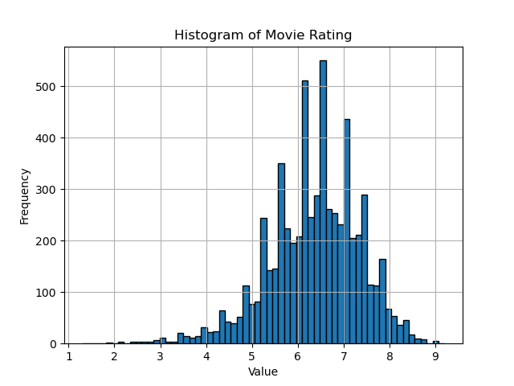
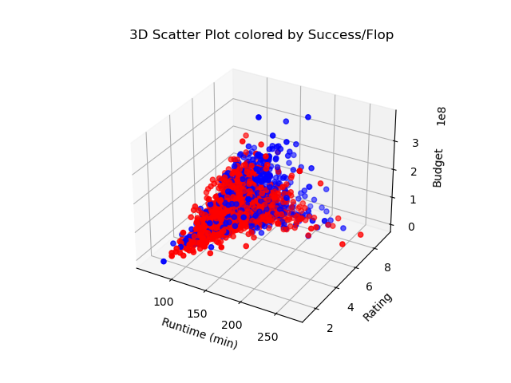
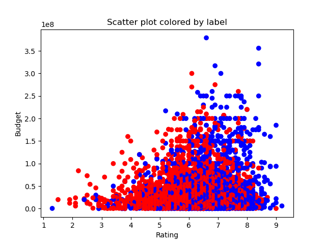

# Post-pandemic-Box-Office

Attendance to movie theatres saw a significant decline after the COVID-19 pandemic, and according to some data sources, has been on a downward trend even prior to 2020. When asked to explain their newfound reluctance, erstwhile moviegoers will cite a range of reasons including ticket prices, the comparative comfort of streaming, rude or distracting behaviour from other clients during the screening of the film, and movie length, to mention but a few reasons.

On the other hand, competing with this rationale is the perception that Hollywood has been churning out cinematic experiences designed to maximize profit but ultimately below par. From this point of view, a crisis in cinema attendance is the natural consequence attending such neglect of movie quality.

We could characterize both views as attributing the present phenomenon to features extrinsic or intrinsic to movie quality, respectively. The objective of the present project is to test the hypothesis that movie quality (the intrinsic view) better accounts for the present crisis in attendance. If that is the case, one expects a machine learning model trained on intrinsic features for movies before the pandemic to have similar accuracy in determining which films will succeed in theatres in the post-COVID era. We test this hypothesis with all the movies released in 2023 for North American cinemas, filtered according to whether they have sufficient box office information. That year is especially suitable because by then most theatres had re-opened and the public at large was able to frequent them again. 

We modeled a movie's performance in theatres as a classification problem with two possible outcomes: success or flop. In accordance with the industry's standards, we made that decision with respect to the movie's worldwide gross versus its budget; to be a success its gross must be at least 2.5 times its gross. To attack the classification problem, we recruited an extreme gradient boosting classifier (XGBClassifier) and a multilayer perceptron. We trained both on pre-2020 data and report a classification error of 0.3072 and 0.3082, respectively. Then, we used both models to make predictions on 2023 obtaining a classification error of 0.2945 and 0.3630, respectively. We judge that this classification error is not significantly higher than for pre-2020 data and see the intrinsic view gaining credence as a consequence.

## Data Sources and Preprocessing
The collection of intrinsic features we gathered are displayed below. Movie genre and certificates are each one-hot encoded for training convenience. The month when the movie was released is also captured and converted to a categorical feature (1-12). This latter feature was collected in the hope of seasonal showing (or close to national holidays) being a factor in the film's classification. 
```
Index(['Runtime_min', 'Rating', 'Action', 'Adult', 'Adventure', 'Animation',
       'Biography', 'Comedy', 'Crime', 'Drama', 'Family', 'Fantasy',
       'Film-Noir', 'History', 'Horror', 'Music', 'Musical', 'Mystery',
       'Romance', 'Sci-Fi', 'Sport', 'Thriller', 'War', 'Western', 'G',
       'NC-17', 'PG', 'PG-13', 'R', 'Budget', 'Month_number'],
      dtype='object')
```
No single publicly-available dataset contains this range of features for a sizable set of movies. To get this information it was necessary to merge datasets from Kaggle, IMDb Non-Commercial Datasets (https://developer.imdb.com/non-commercial-datasets/), The Numbers, Box Office Mojo, and the World Wide Box Office (https://worldwideboxoffice.com/). Sometimes we could accomplish this through a unique identifier (think of the IMDb IDs for example) which guaranteed enrichment of the right entries, and sometimes a mix of name and year was used instead. Web scraping and manual input was also needed for the final part of the process to fill information after merging; naturally when scraping, the policy of the respective website was consulted and respected. Many of the utility files used for this part of the process are under the "Pandas_utilities" folder of the project.

A quick plot illustrates the distribution of the datapoints by rating. Some values are over-represented but it roughly approximates a normal distribution. 



We can also visualize what one could predict as the most salient features and their effect. It is already clear from the graph below that we are facing a difficult classification problem. This could be counterintuitive at first: why is movie quality (using IMDb rating as a proxy) not enough to determine box office triumph? Or to be more precise, why is there no clear boundary determined by rating after which all movies are successful even if it does not separate the data perfectly? 

It might be helpful to consider that even a movie like "The Shawshank Redemption", which is nowadays the subject of universal acclaim, was still by industry standards a flop in cinemas. These reflections are leading us to see the partial disconnect between popularity and quality, that of course is a very complex topic on its own. However, we draw encouragement from the fact that they are at least correlated so that if properly aggregated to other features there is reason to think that we can at least reach better than random accuracy.



As we might hope, higher rating at least correlates with a positive outcome at the box office. 


The movies comprising the dataset date from 1934 onwards. Since 1934 was the year when the Hays code took effect, a set of directives dictating if a film was fit for public distribution and showing, multiple films were labelled "Approved" or "Passed" per the code. Everyone seems to concur that it was a strict set of guidelines so we relabelled such films as "G" under the Motion Picture Association rating system (MPA). Similarly, movies rated under the Canadian, British, Australian, among other systems, were converted to the MPA system (G, PG, PG-13, R, NC-17).

With respect to worldwide gross, we did not adjust for inflation as the final figure is an aggregation of all the movie's releases, hence of revenue from different years, which would be very difficult to control for a dataset of this magnitude. It is also important to clarify, that worldwide gross does not include DVD sales or income by streaming. The term is used in the industry as encompassing solely box office at cinemas in all the world. Both this statistic and the budget of a film are, as we found out, considerably inexact and there is real risk of inflation or deflation as it better suits the whims of a studio. That being said, to asess if 2.5 times the budget is less than gross was often clear from the scale of each of the two statistics (budget and gross) so that the assessment of the movie's triumph was robust. 

Another variable impacting our analysis is that during the pandemic studios began to experiment with simultaneous release in cinemas and streaming services. A model trained before this paradigm would have necessarily suffered as a result when evaluating post-pandemic productions. Fortunately for us, this experiment was limited to the pandemic and though for some productions the window between theatre release and streaming release was shortened, at least the majority of the films in 2023 were guaranteed to debut in cinemas and have 30 days there before being available elsewhere. 

Having concluded data cleaning, we standardize training data to facilitate training and so that categorical features that were one-hot encoded are given the same relevance as continuous features like budget. 

## Model Training

We trained a multilayer perceptron (MLP) with 1 to 5 hidden layers and varying number of neurons and an XGBClassifier with 100 trees. In both cases, the data was separated so that 30% was saved for cross-validation and testing; concretely, 15% of the initial data for each task. 

In the case of the multilayer perceptron, the network was trained with the binary cross entropy function as a loss function and adaptative gradient descent (Adam optimizer). Nowadays, the common practice is to use hidden layers of ReLU neurons but we experimented with sigmoid layers as well. The outer layer was linear and we specify so when parsing the loss function, so that it computes a sigmoid at the end in a numerically stable manner. Accordingly, when making predictions we need to manually compute the sigmoid of a list of features before evaluating. 

We had recall and precision in mind when opting for an accuracy metric, but the simpler classification error was deemed appropriate for our purposes. That is, the percentage of incorrectly classified datapoints though simple already captured our optimization goals. Then, paying attention to classification error, we tuned the number of layers, type of neurons, and number of steps in order to minimize training loss while keeping validation loss close to training loss. Given that working with multilayer perceptrons having several layers is computationally demanding, we implemented early stopping for training.

We found that a rather rudimentary model with one hidden layer of 40 neurons was as satisfactory as more complex models. When using more than 40 neurons per layer the model began to overfit the data, whereas layering several times 20 to 40 neurons did not noticeably improve loss and validation loss. We also tried to regularize complex models but there is a barrier for loss around 0.54 and validation loss of 0.58, beyond which one is hard pressed to minimize training loss without increasing validation loss. Eliminating some of the features, particularly those related to the MPA certificate of a film or movie genre did not help either.

In contrast to MLP training, training an extreme gradient boosting classifier did not require of extensive tuning to obtain comparable results. Employing a simple architecture of 100 trees, with maximum depth 4, and learning rate of 0.1 we get to a similar classification error.  

## Results

We report that the multilayer perceptron with one hidden layer of 40 neurons and an outside layer consisting of one sigmoid activation function, had training classification error of 0.2731 and cross-validation classification error of 0.2926. On the testing dataset we report a classification error of 0.3072. On the other hand, the XGBClassifier had a training error of 0.2435 and cross-validation error of 0.2937, but results in a testing error of 0.3082.

Finally, to test the hypothesis we evaluate the models on movies released during 2023, to obtain a classification error of 0.2945 for the MLP and 0.3630 for the XGBClassifier. The difference with the testing classification error is hence overall marginal and we are led to think that in the assessment of a film's box office promise, persisting features like movie quality, budget, release month, and so on are better predictors than competing extrinsic features, even in the post-pandemic market.

This finding is surprising in that it seems to run counter ticket price per the US Kagan Consumer Insights survey, or habituation to streaming at home according to other sources, as driving or being fundamental to understanding cinema attendance phenomena. It remains to be seen if model performance can be pushed further to give the insights of our study greater weight, although even now we have a reasonably solid platform to encourage others to explore the cinema attendance crisis from an intrinsic paradigm. 
